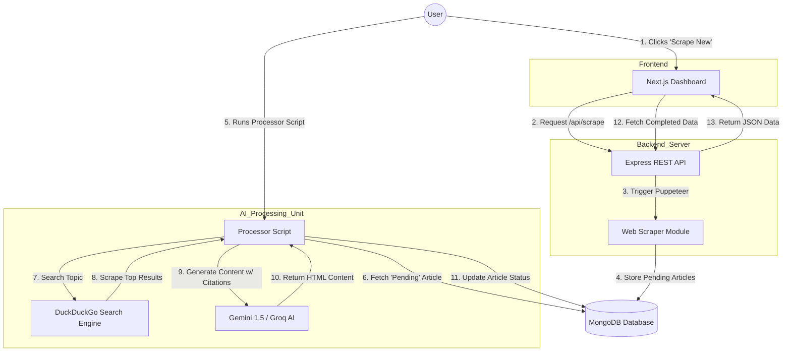

# BeyondChats Full Stack AI Assignment

**Live Demo:** [Insert Your Live Link Here or 'Running Locally']  
**Video Walkthrough:** [Optional: Insert Link if you record one]

## 🚀 Project Overview

This is a Full Stack MERN application developed for the BeyondChats internship assignment. It automates the process of content enhancement using Generative AI.

The system performs three key phases:

1.  **Scrape:** Fetches legacy blog articles from `beyondchats.com` and stores them in a MongoDB database.
2.  **Process (AI Agent):** A robust background script searches the web (using DuckDuckGo & Puppeteer) for the latest information on the article's topic, scrapes top sources, and uses **Google Gemini 1.5** (with Groq/Llama3 fallback) to rewrite the article.
3.  **Display:** A modern, responsive **Next.js** dashboard displays the "Original vs. AI Enhanced" versions side-by-side.

---

## 🏗️ Architecture & Data Flow

Below is the high-level architecture of the system:



🛠️ Tech Stack
Frontend (Phase 3)
Framework: Next.js 14 (App Router)

Styling: Tailwind CSS v4

HTTP Client: Axios

Features: Responsive Sidebar, Real-time status badges, HTML rendering for AI content.

Backend (Phase 1)
Runtime: Node.js

Framework: Express.js

Database: MongoDB (Mongoose)

Scraping: Puppeteer (Headless Browser)

API: RESTful Endpoints (GET, POST, PUT, DELETE)

AI Processor (Phase 2)
Logic: Standalone Node.js Script (scripts/processArticles.js)

Search: DuckDuckGo HTML (No API key required, bypasses bot detection)

GenAI Models: \* Primary: Google Gemini 1.5 Pro

Fallback 1: Google Gemini 1.5 Flash

Fallback 2: Groq (Llama3-70b)

⚙️ Local Setup Instructions
Follow these steps to run the project locally.

Prerequisites
Node.js (v18 or higher)

MongoDB (Installed locally or use a MongoDB Atlas URI)

1. Clone the Repository
   Bash

git clone <your-repo-url>
cd beyondchats-assignment 2. Backend Setup
Bash

cd backend
npm install

# Create Environment Variables

# Create a file named .env in the backend/ folder with the following:

# PORT=5000

# MONGO_URI=mongodb://localhost:27017/beyondchats_assignment

# GEMINI_API_KEY=your_google_gemini_key

# GROQ_API_KEY=your_groq_key (Optional)

# Start the Server

npm run dev
Server runs on: http://localhost:5000

3. Frontend Setup
   Open a new terminal.

Bash

cd frontend
npm install

# Start Next.js

npm run dev
Frontend runs on: http://localhost:3000

🤖 How to Use
Phase 1: Scrape Articles
Open the frontend (http://localhost:3000).

Click the "+ Scrape New" button in the sidebar.

The backend will visit beyondchats.com, fetch the latest blog titles, and save them to the database with a status of pending.

Phase 2: Run AI Processor
Open your terminal inside the backend folder.

Run the processor script:

Bash

node scripts/processArticles.js
What happens:

The script picks one pending article.

It searches the web for the title.

It reads the top 2 search results.

It sends the context to the AI to rewrite the article.

It saves the result and marks the status as completed.

Repeat the command to process more articles.

Phase 3: View Results
Refresh the frontend.

Click on the article in the sidebar (now marked Green/Completed).

View the Original Source link on the left and the AI Rewritten Article on the right, complete with references.

📂 Project Structure
Plaintext

beyondchats-assignment/
├── backend/
│ ├── models/ # Mongoose Schemas (Article.js)
│ ├── routes/ # API Routes
│ ├── scripts/ # The AI Processor Script (Phase 2)
│ ├── utils/ # The Scraper Logic
│ ├── server.js # Entry point
│ └── .env # Secrets (Not committed)
│
├── frontend/
│ ├── src/app/ # Next.js Pages & Components
│ ├── tailwind.config.js # (Configured for v4 via CSS)
│ └── package.json
│
└── README.md # Documentation
🛡️ License
This project is submitted as an assignment for the BeyondChats hiring process.

---

### **Final Checklist**

1.  **Git Ignore:** Ensure you have a `.gitignore` file in your root folder so you don't upload 500MB of node modules.
    - **Create `.gitignore`** with this content:
      ```text
      node_modules
      .env
      .DS_Store
      .next
      ```
2.  **Commit:** `git add .` -> `git commit -m "Final Submission"` -> `git push`.
3.  **Live Link:** If you deploy it (optional but recommended for the extra 10%), update the link at the top of the README.

**You are ready to roll! Good luck with the submission!** 🚀
